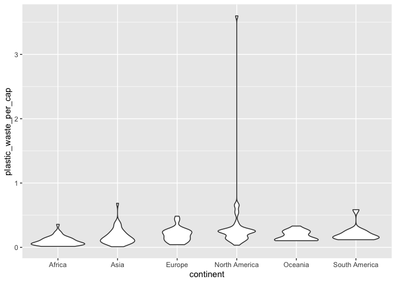

Lab 02 - Plastic waste
================
Elayna Seago
1/25/22

## Load packages and data

``` r
library(tidyverse) 
```

``` r
plastic_waste <- read.csv("data/plastic-waste.csv")
```

## Exercises

### Exercise 1

The continents show quite a lot of similarity, for all continents people
in the majority of countries produce less than 1kg of plastic waste per
year. The exception is Trinidad and Tobago, shown on the graph of North
America, where people produce more than 3.5kg of plastic waste per year.

``` r
ggplot(data = plastic_waste, aes(x = plastic_waste_per_cap)) +
  geom_histogram(binwidth = 0.2)
```

    ## Warning: Removed 51 rows containing non-finite values (stat_bin).

<!-- -->

``` r
plastic_waste %>%
  filter(plastic_waste_per_cap >3.5)
```

    ##   code              entity     continent year gdp_per_cap plastic_waste_per_cap
    ## 1  TTO Trinidad and Tobago North America 2010    31260.91                   3.6
    ##   mismanaged_plastic_waste_per_cap mismanaged_plastic_waste coastal_pop
    ## 1                             0.19                    94066     1358433
    ##   total_pop
    ## 1   1341465

``` r
ggplot(data = plastic_waste, aes(x = plastic_waste_per_cap)) +
  geom_histogram(binwidth = 0.2) +
  facet_wrap(~continent)
```

    ## Warning: Removed 51 rows containing non-finite values (stat_bin).

<!-- -->

``` r
ggplot(data = plastic_waste, aes(x = plastic_waste_per_cap)) +
  geom_density()
```

    ## Warning: Removed 51 rows containing non-finite values (stat_density).

<!-- -->

``` r
ggplot(data = plastic_waste,
       mapping = aes(x = plastic_waste_per_cap,
                     color = continent,
                     fill = continent)) +
  geom_density(alpha = .7)
```

    ## Warning: Removed 51 rows containing non-finite values (stat_density).

<!-- -->

### Exercise 2

Defining specifications in aesthetics mapping changes how variables are
mapped onto the graph while defining specifications in geom_density
changes elements of the graph (regardless of what variable they are
associated with).

``` r
ggplot(data = plastic_waste,
       mapping = aes(x = plastic_waste_per_cap,
                     color = continent,
                     fill = continent)) +
  geom_density(alpha = .3)
```

    ## Warning: Removed 51 rows containing non-finite values (stat_density).

<!-- -->

``` r
ggplot(data = plastic_waste,
       mapping = aes(x = continent, y = plastic_waste_per_cap))+
  geom_boxplot()
```

    ## Warning: Removed 51 rows containing non-finite values (stat_boxplot).

<!-- -->

### Exercise 3

The box plots show each outlier more distinctly with individual dots per
outlier. The violin plot makes it impossible to miss an outlier.The
violin plot also shows the density of data at each value of plastic
waste per capita.

``` r
ggplot(data = plastic_waste,
       mapping = aes(x = continent, y = plastic_waste_per_cap))+
  geom_violin()
```

    ## Warning: Removed 51 rows containing non-finite values (stat_ydensity).

<!-- -->

### Exercise 4

There is a positive relationship between plastic waste per capita and
mismanaged plastic waste per capita. This makes sense because the more
waste you have the more waste you can mismanage.

``` r
ggplot(data = plastic_waste,
       mapping = aes(x = plastic_waste_per_cap, y = mismanaged_plastic_waste_per_cap)) +
  geom_point()
```

    ## Warning: Removed 51 rows containing missing values (geom_point).

<!-- -->

### Exercise 4.2

There are some distinctions. Europe seems to have a lower rate of
mismanaged plastic per capita given the amount of plastic waste they
have per capita. North America is also doing well barring Trinidad and
Tobago.

``` r
ggplot(data = plastic_waste,
       mapping = aes(x = plastic_waste_per_cap, y = mismanaged_plastic_waste_per_cap, color = continent)) +
  geom_point()
```

    ## Warning: Removed 51 rows containing missing values (geom_point).

<!-- -->

### Exercise 4.3

The relationship between these pairs looks fairly similar to me.

``` r
ggplot(data = plastic_waste,
       mapping = aes(x = total_pop, y = plastic_waste_per_cap, color = continent))+
  geom_point()
```

    ## Warning: Removed 61 rows containing missing values (geom_point).

<!-- -->

``` r
ggplot(data = plastic_waste,
       mapping = aes(x = coastal_pop, y = plastic_waste_per_cap, color = continent))+
  geom_point()
```

    ## Warning: Removed 51 rows containing missing values (geom_point).

<!-- -->

### Exercise 5

This graph plots the relationship between the proportion of a country’s
population that is coastal and the amount of plastic waste per capita in
that country. There is also a smoothing line with standard error bars
that shows the trend. There appears to be a positive relationship
between proportion of coastal population and plastic waste, though the
relationship doesn’t really look that linear.

``` r
ggplot(data = plastic_waste%>%
         filter(plastic_waste_per_cap<3),
       mapping = aes(x =(coastal_pop/total_pop), y = plastic_waste_per_cap, color = continent))+
  geom_point()+
  geom_smooth(inherit.aes = FALSE, aes(x =(coastal_pop/total_pop), y = plastic_waste_per_cap))+
  labs(title = "Plastic waste vs Coastal population proportion",
       subtitle = "by continent",x = "Coastal population proportion (coastal/total population)")
```

    ## `geom_smooth()` using method = 'loess' and formula 'y ~ x'

    ## Warning: Removed 10 rows containing non-finite values (stat_smooth).

    ## Warning: Removed 10 rows containing missing values (geom_point).

<!-- -->

### Exercise 6

Remove this text, and add your answer for Exercise 6 here.

``` r
# insert code here
```

### Exercise 7

Remove this text, and add your answer for Exercise 7 here.

``` r
# insert code here
```

``` r
# insert code here
```

### Exercise 8

Remove this text, and add your answer for Exercise 8 here.

``` r
# insert code here
```

## Pro-Tips

### Excercise 3

Try this :D

ggplot(data = plastic_waste, mapping = aes(x = continent, y =
plastic_waste_per_cap)) + geom_violin()+ geom_boxplot(width=.3,
fill=“green”) + stat_summary(fun.y=median, geom=“point”)

### Exercise 5

Helpful
reference:<http://www.sthda.com/english/wiki/ggplot2-themes-and-background-colors-the-3-elements>
